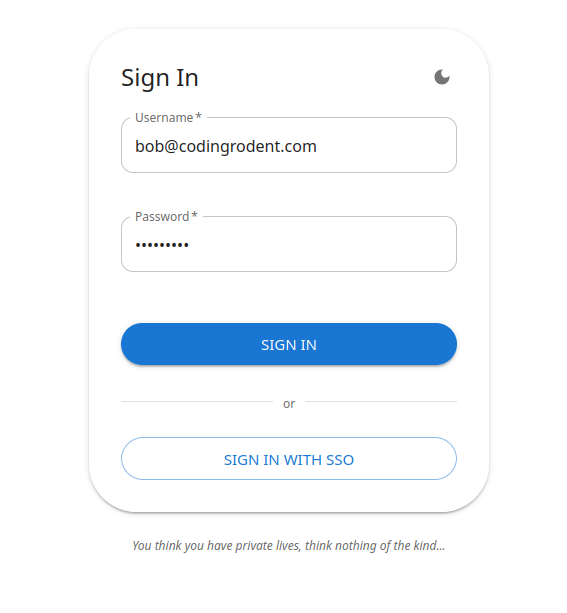
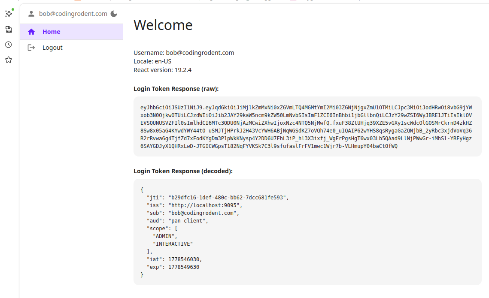
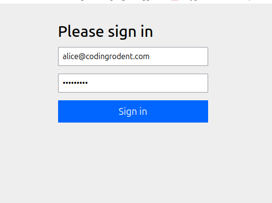
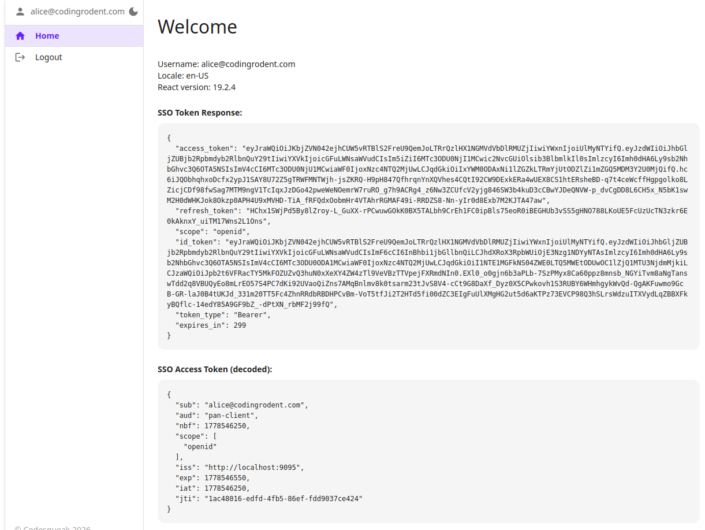

[](https://opensource.org/license/mit)

# OAuth 2 Example with Spring Boot and React

This project was created as a practical note to demonstrate how to use OAuth 2 with Spring Boot 4 after a frustrating experience 
trying to get it working by piecing together documentation and examples that were often unclear or seemingly incomplete.


This demonstration features:

1. An OAuth 2 server built using the Spring Boot starter library oauth2-authorization-server
2. An alternative Bearer Token generator using username / password
3. A simple React project showing both username/password and SSO logins

The two projects are in the subdirectories ```UserService``` and ```ui```

What you need:

[Java 25 ](https://adoptium.net/en-GB/temurin/releases?version=25&os=any&arch=any)

[npm](https://docs.npmjs.com/downloading-and-installing-node-js-and-npm)


## To Build & Run The Java Project

```
./gradle clean build test
java -jar build/libs/UserService-1.0.<version goes here>-SNAPSHOT.jar

```

## To Run The UI Project

```
npm install
npm run dev
```

The passwords for ```alice``` & ```bob``` are ```password1```

Project login page: ```http://localhost:5173/```


# What You Get - Username/Password






# What You Get - SSO






